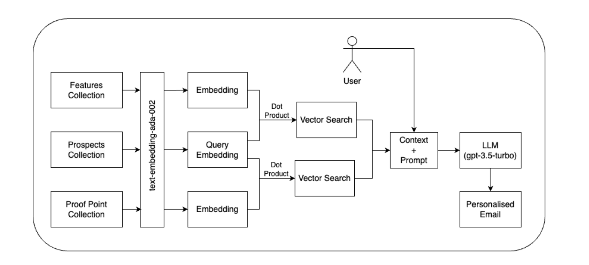

# mReach - Leads? In it to win it!

Try out the app here: [mReach](https://iReach-dodfh.mongodbstitch.com/)
\
\
Okay! Ritchie is giving a hint!\

## Team Details
Project: mReach
Team Name: India SA Team\
Team Number: 8
- Ajay Raghav
- Nitin Mukheja
- Vinod Krishnan
- Rashi Yadav
- Siddharth Gupta
- Vaibhav Mehra
- Sandhya Dev
- Aditya Kishore    

Leaders:
- Rajat Bhasin
- Vinay Agarwal
- Himanshumali

Demo Video: [Link Here!]

## Business Justification
Sales and marketing professionals often struggle to craft personalized emails that effectively engage potential leads, resulting in lower conversion rates and wasted efforts.
A lot of events, mass mails, cold calls ... and then some more!\
A lot of work goes here and a small % gets converted to decent amount of leads which are then sent to SDRs.\
The work doesn't end here.

**Issue with this:**
- Generic Content & Lack of Personalisation
- Manual Work & Time Constraint
- Limited Data Insights
- Poor Data Segmentation and hence, Limited Audience Targeting
- Ineffective Communication

What we're focusing on: (**MDB Differentiators**)
- Developer Productivity (DDP)
- Breezy Search Experience & Personalisation (Atlas Search & Atlas Vector Search...Duh!)
- Scalability
- Accelerate Time to Value

## What does mReach do? / Overview
TLDR: Better Lead Conversions!

Introducing mReach, the avant-garde marketing automation platform that revolutionizes how businesses engage with prospects. By leveraging the latest in AI-driven personalization, including cutting-edge embedding models and vector search technologies, mReach delivers unparalleled context and relevance in every email. This sophisticated approach ensures that each message is not only personalized but also deeply resonant with the recipient's current needs and interests, significantly boosting engagement and conversion rates. mReach goes further by incorporating relevant proof points into communications, enhancing client interactions by vividly demonstrating the value of your product. With seamless integration, comprehensive analytics for ongoing refinement, and a commitment to genuine connection, mReach transforms cold outreach into a dynamic, personalized conversation.

_**Welcome to mReach, where every email is an opportunity to connect, engage, and grow with purpose.**_

## mReach Tech Stack: 
- OpenAI (text-embedding-ada-002, gpt-3.5-turbo-16k)
- Atlas Search
- Atlas Vector Search
- Time-Series Collections
- Atlas Charts
- Atlas App Services (Triggers, Functions Hosting, HTTPS Endpoints)
- MERN

## Architecture:

### High Level Design/Arch

### Low Level Design/Arch

## Roles & Responsibilities:
**Frontend Development:**
_Ajay Raghav_, _Rashi Yadav_
  
**Backend Development:**
_Vinod Krishnan_, _Siddharth Gupta_, _Ajay Raghav_

**Data Generation:**
_Vaibhav Mehra_, _Sandhya Dev_, _Aditya Kishore_, _Nitin Mukheja_

**ReadMe.md:**
_Nitin Mukheja_, _Rashi Yadav_, _Sandhya Dev_

**Architecture:**
_Siddharth Gupta_, _Vinod Krishnan_, _Vaibhav Mehra_

**Charts & Visualisations & Timeseries:**
_Aditya Kishore_, _Nitin Mukheja_

## Demo Script!
[DemoScript](https://docs.google.com/document/d/10eF64G5yOxgDmLgkXDCB7XLO2mu3UujR9qV5fZvrb4I/edit?usp=sharing)

## What's the cake? 

### Results
You can see customised e-mail templates based on the industry. Also, you can mention your Name(Ex:John Doe) and Designation(Ex: Solutions Architect) for mail generation and a proper mail will be generated along with a MongoDB Customer Story (a.k.a Proof Points 😃)
\
This will lead to better conversion rates since the customer now has access to a well-curated response + a proof point to strengthen the response.

That's not all!

The logged in User will be able to see really cool dashboards that gives an overview of deals segregated by their stages, the metrics for # of e-mails sent vs # of e-mail responses.  
  
mReach uses cool Search features like Fuzzy Search & Autocomplete Search:

  
Next, a Sales Exec searches for a use-case and generates e-mail for one of the customers. 
The mail content can be curated to be more deal and business-centric.
### _Cherry on the cake: Links to MongoDB Proof Points!_

  

Similary, a Solutions Architect can use mReach too for generating a technical e-mail content:

  
Up Next: the user will be able to see Dashboards and Charts metrics for their deals in their specific stages, # of mails sent vs responded, outreach reports, etc:

  
Psst... Number of e-mails sent and e-mails responded is a chart built on Time-Series Collection.\
**_So, I'm basically looking at Leads Conversion Rate powered by Time-Series Collections 🤍_**

That's all Folks!\
Fin!
